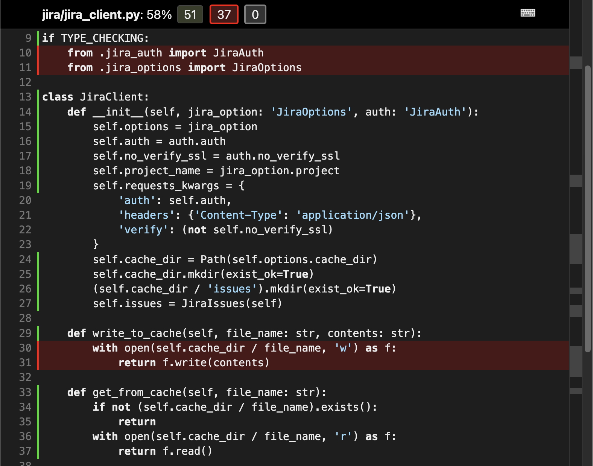

# Mantis

Command line interface for writing and maintaining your Jira tasks from the command line.
Edit locally in your preferred editor and sync to Jira when ready.

## Getting started

This project must be installed using [Poetry](python-poetry.org):

```sh
$ poetry install
```

### Generate a Jira token:

Head over to your Jira and under [manage-profile / security 
/ api-tokens](https://id.atlassian.com/manage-profile/security/api-tokens),
click on `Create API token`

> [!WARNING]
> Don't share this code with anyone, please read the official Jira docs on
[API authentication](https://developer.atlassian.com/cloud/jira/platform/basic-auth-for-rest-apis/))
and [API tokens](https://support.atlassian.com/atlassian-account/docs/manage-api-tokens-for-your-atlassian-account/)
if you need more information.

### Fill out the options toml:

```sh
$ cp options-example.toml options.toml
$ vi options.toml
```

Your `options.toml` needs to be filled out with your personal data,
including the Jira token you just created.
It should **not** be added to source control.
You new file should look something like the following example:

```toml
[jira]
user = "name@company.com"
url = "https://company-account.atlassian.net"
project = "TEAMNAME"
personal-access-token = "qwerqwer-asdfasdf-zxcvzxcv"
cache-dir = ".jira_cache"
```

### Then run the tests:

```sh
$ poetry run pytest
```

## Installing

```sh
$ poetry install
```

## Running the CLI

```sh
$ mantis test-auth
Connected as user: Admin9000

$ mantis TASK-1
[TASK-1] Setup Jira

$ mantis fetch-issuetypes
Updated local cache for issuetypes:
[{'description': 'Created by Jira Agile - do not edit or delete. Issue type '
                 'for a user story.',
  'id': 6,
  'name': 'Story'},
[...]

# Re-fetches config files
$ mantis reset
['Epic', 'Subtask', 'Task', 'Story', 'Bug']

# Fornat the fetched json in the Jira cache
$ find .jira_cache -type f -name '*.json' -exec sh -c 'jq . "$1" > "$1.tmp" && mv "$1.tmp" "$1"' _ {} \;
```

For iterative testing, we can rely on the functions defined in `scripts/development-functions.sh` to reset and/or re-populate the cache and drafts directory:

```sh
reset_cache() {
  mantis reset
}

jsonfmt() {
  mantis reset
  find .jira_cache -type f -name '*.json' -exec sh -c 'jq . "$1" > "$1.tmp" && mv "$1.tmp" "$1"' _ {} \;
}

getandfmt() {
  jsonfmt
  mantis get-issue ECS-1 ECS-2 ECS-3 ECS-4 ECS-5 ECS-6
}
```

Or to overwrite options on the command line (remember to set the JIRA_TOKEN env var):

```sh
$ mantis \
    --user user@domain.com \
    --personal-access-token $JIRA_TOKEN \
    --jira-url=https://account.atlassian.net
[...]
```

## Extended testing

```sh
$ poetry run pytest

# Run tests every time a file changes (using `pytest-xdist`):
$ poetry run pytest -f

# Skip slow tests:
$ poetry run pytest -m "not slow"

# Show test coverage for each file
$ poetry run pytest --cov

# Generate coverage report (written to ./htmlcov)
$ poetry run pytest --cov-report html --cov

# Measure slowest test
$ poetry run pytest  --durations=3
2.94s call     tests/test_jira_config_loader.py::TestConfigLoader::test_update_createmeta
0.05s call     tests/test_jira_inspector.py::TestInspector::test_get_project_field_keys_from_cache
0.05s teardown tests/test_jira_options.py::TestJiraOptions::test_jira_options_not_set

# Skip tests marked with @pytest.mark.slow decorator
$ poetry run pytest -m "not slow"
```

See functions in `development-functions.sh`:

```sh
run_coverage() {
  poetry run pytest --cov
}

show_coverage() {
  poetry run pytest --cov-report html --cov
  open htmlcov/index.html
}
```

An example of the coverage report:



## Running MyPy

Ensuring typehint coverage (this is also run during [GitHub Actions](.github/workflows/python-app-ci.yml)).

```
$ poetry run mypy --disallow-untyped-calls --disallow-untyped-defs --disallow-incomplete-defs src
Success: no issues found in 10 source files
```

## Running Flake8

```sh
$ poetry run flake8 mantis --count --select=E9,F63,F7,F82 --show-source --statistics                 
0
$ poetry run flake8 mantis --count --exit-zero --max-complexity=10 --max-line-length=127 --statistics
mantis/jira/__init__.py:1:1: F401 '.jira_auth.JiraAuth' imported but unused
mantis/jira/__init__.py:2:1: F401 '.jira_client.JiraClient' imported but unused
mantis/jira/__init__.py:3:1: F401 '.jira_issues.JiraIssue' imported but unused
mantis/jira/__init__.py:3:1: F401 '.jira_issues.JiraIssues' imported but unused
mantis/jira/__init__.py:4:1: F401 '.jira_options.JiraOptions' imported but unused
mantis/jira/__init__.py:4:1: F401 '.jira_options.parse_args' imported but unused
mantis/jira/__init__.py:5:1: F401 '.utils.JiraSystemConfigLoader' imported but unused
mantis/jira/utils/__init__.py:1:1: F401 '.cache.Cache' imported but unused
mantis/jira/utils/__init__.py:2:1: F401 '.jira_system_config_loader.JiraSystemConfigLoader' imported but unused
12    F401 '.jira_auth.JiraAuth' imported but unused
12
```

# Generate types

```python
from plugins import model
for x in dir(model): print (x)
... 
Assignee
Attachment
AvatarUrls
BaseModel
Components
Configuration
Customfield10001
Customfield10002
Customfield10003
[...]
```

# Persisting example payloads for tests

```sh
$ mantis reset
$ mantis get-issue ECS-1 ECS-2 ECS-3 ECS-4 ECS-5 ECS-6
[ECS-1] (Sample) User Authentication
[ECS-2] (Sample) Payment Processing
[ECS-3] (Sample) Credit Card Payment Integration
[ECS-4] (Sample) User Registration
[ECS-5] (Sample) Order Confirmation
[ECS-6] (Sample) User Login
```

# Copy to test data

Copy demo data to the test directory:

```sh
$ cp -rf drafts/ tests/data/drafts
$ cp -rf .jira_cache/* tests/data/jira_cache/
```

Format the JSON files using `jq`:

```sh
$ find tests/data/jira_cache -type f -name '*.json' -exec sh -c 'jq . "$1" > "$1.tmp" && mv "$1.tmp" "$1"' _ {} \;
```

Then anonomize the files:

```sh
$ find tests/data/ -type f -name '*.json' -exec sh -c '
  for file do
    # Format JSON with jq, then replace emails
    tmp="${file}.tmp"
    if jq . "$file" > "$tmp"; then
      # Replace emails with dummy value (e.g., dummy@example.com)
      sed -E -i.bak "s/[a-zA-Z0-9._%+-]+@[a-zA-Z0-9.-]+\.[a-zA-Z]{2,}/dummy@example.com/g" "$tmp"
      mv "$tmp" "$file"
      rm "$tmp.bak"
    else
      echo "Invalid JSON: $file"
      rm -f "$tmp"
    fi
  done
' sh {} +
```

All in one function in `development-functions.sh`:

```sh
update_test_data() {
    cp -rf drafts/ tests/data/drafts
    cp -rf .jira_cache/* tests/data/jira_cache/
    format_test_data
    anonymize_test_data
}
```
